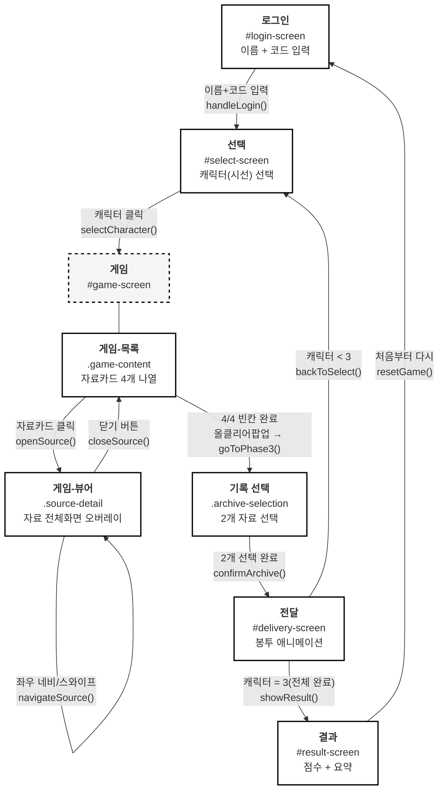
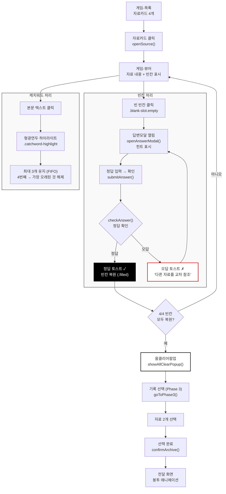

# DMZ 다이어리 — 게임 구조도

> 게임의 화면 흐름, 데이터 구조, 주요 로직을 시각화한 문서.
> mermaid 다이어그램은 GitHub에서 자동 렌더링됩니다.

## 1. 화면 플로우



## 2. 데이터 구조

```mermaid
classDiagram
    class GAME_DATA {
        soldier: Character
        student: Character
        historian: Character
    }

    class Character {
        title: string
        icon: SVG
        charName: string
        desc: string
        location: string
        era: string
        destination: string
        soundNote: string
        sources: Source[4]
        blanks: Record~string, Blank~
        choices: Choice[4]
    }

    class Source {
        id: "A" | "B" | "C" | "D"
        type: "letter" | "diary" | "scholar" | "newspaper" | "photo" | "oral"
        icon: SVG
        title: string
        sub: string
        styleClass: string
    }

    class Blank {
        answer: string
        hint: string
        source: "A" | "B" | "C" | "D"
        altAnswers: string[]
    }

    class Choice {
        icon: SVG
        title: string
        meaning: string
    }

    class State {
        playerName: string
        currentChar: string | null
        currentSourceId: string | null
        solvedBlanks: Record~string, string~
        selectedRecords: number[]
        totalCranes: number
        completedStories: string[]
        catchwords: Catchword[]
    }

    class Catchword {
        sourceId: string
        wordIndex: number
        text: string
    }

    class LocalStorage {
        key: "dmz_diary_{playerName}"
        totalCranes: number
        completedStories: string[]
        playerName: string
    }

    GAME_DATA --> Character : 캐릭터 3명
    Character --> Source : sources[4]
    Character --> Blank : blanks (A,B,C,D)
    Character --> Choice : choices[4]
    Blank --> Source : source (교차참조 출처)
    State --> Catchword : catchwords (최대 3개)
    State --> LocalStorage : saveState() / loadStateForPlayer()
```

## 3. 자료 처리 플로우


