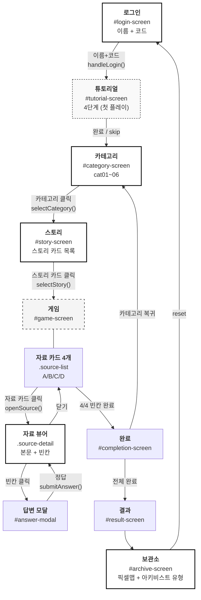
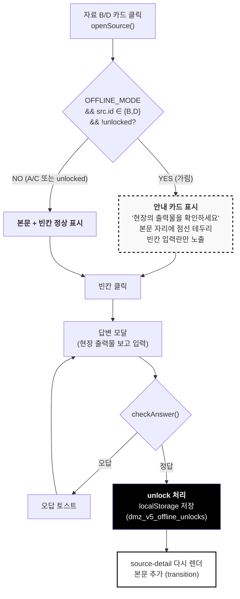
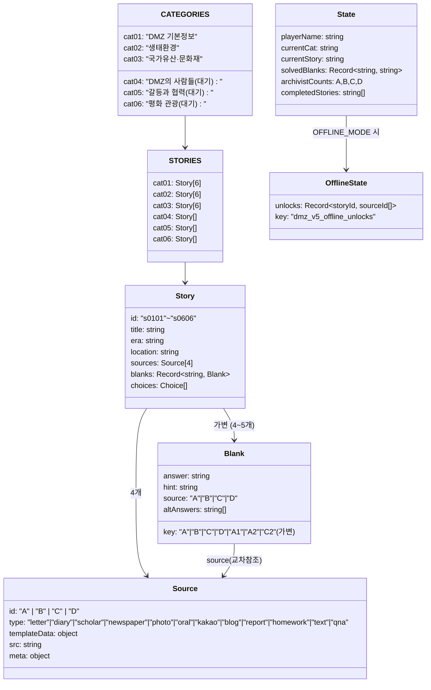
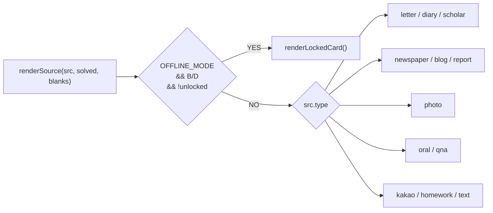
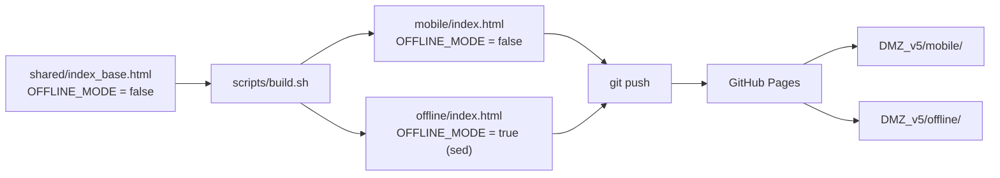

# DMZ v5 — ARCHITECTURE

> 게임 구조도 + 화면 흐름 + offline 분기. mermaid 다이어그램은 GitHub에서 자동 렌더.

## 1. 화면 플로우 (mobile + offline 공통)

## 2. offline 분기 — BD unlock 플로우

## 3. 데이터 구조

## 4. 자료 type 분기 (renderSource)

각 type별 CSS 클래스: `.letter-paper`, `.diary-paper`, `.newspaper-paper`, `.photo-frame`, `.oral-player`, `.kakao-bubble` 등 — UI-MAP.md에서 정리.

## 5. 빌드 산출 흐름

