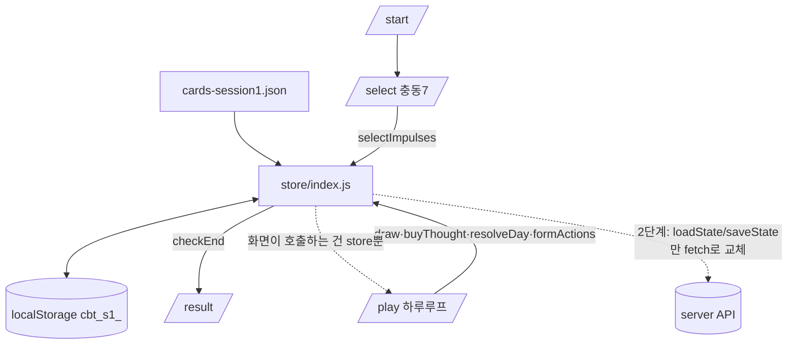

---
tags:
  - 개발
  - cbt-the-game
  - SPEC
created: 2026-06-22
author: 아리공
---

## ARCHITECTURE — CBT 덱빌딩 게임

> 1단계 로컬 우선. 화면 ↔ store ↔ 데이터. 2단계는 store 본문만 서버 API로 교체(화면·시그니처 불변).

### 폴더

```
_dev/cbt-the-game/
├─ PLAN.md (포인터)
├─ docs/   PLAN·TASKS·CANON·SPEC-mechanics·SPEC-data·SPEC-screens·ARCHITECTURE
├─ data/   cards-session1.json (캐넌 카드, 빌드 시 client/data로 복사 or import)
└─ client/ (manifestia 복제)
   ├─ package.json · vite.config.js · index.html
   └─ src/  main.jsx · App.jsx(router) · store/index.js · screens/ · components/ · i18n/ · index.css
```

### 데이터 흐름



### 상태 경계 (2단계 대비)

- 화면은 `store`의 도메인 함수만 호출. localStorage 접근·게임 규칙·승패 판정은 전부 store 내부.
- 2단계 전환 = `loadState`/`saveState`(+도메인 함수 본문)를 서버 fetch로 교체. screens·components 무수정.
- `[2단계 권장]` 1단계부터 store 함수를 Promise 반환으로 선설계하면 전환 비용 최소.

### 빌드/실행

- `npm run dev`(vite) 로컬, `npm run build` → dist. 배포·git repo는 빌드 후 확정.
- 검증: vite preview + CDP 헤드리스 드라이버(클리어/실패/뽑기멈춤/영속/예외0).
