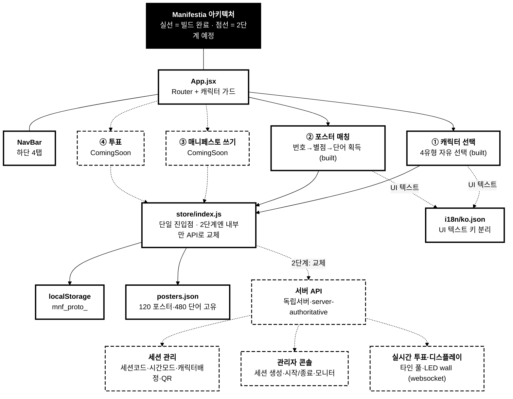

## Manifestia 아키텍처 — 현황과 이음매

> 1단계(폰 단독) 빌드가 어디까지 와 있고, 2단계(서버)가 어디에 끼어드는지를 한 장으로 본다.
> 머메이드 원본: `_dev/apps/mermaid/diagrams/manifestia-architecture.mmd` (MermaidLab 뷰어 등록됨)
> 명세: `docs/SPEC-prototype.md` / 계획: `docs/PLAN.md` / 진행: `docs/TASKS.md`

#### 한눈에

실선은 빌드 완료, 점선은 2단계 예정입니다. 핵심은 가운데 **store/index.js** 한 겹이에요. 화면들은 데이터를 직접 만지지 않고 전부 이 레이어를 통해서만 상태를 읽고 씁니다. 그래서 2단계에서 localStorage를 독립서버 API로 바꿀 때, 이 레이어 안쪽만 갈아끼우면 화면 코드는 손대지 않아도 됩니다. 서버 작업이 들어올 자리가 이미 설계로 비워져 있다는 뜻입니다.

#### 층별 설명

**클라이언트 (React + Vite).** App.jsx가 라우터 겸 관문입니다. 캐릭터를 안 고른 상태로 매칭 화면에 들어가려 하면 `RequireCharacter` 가드가 캐릭터 선택으로 돌려보냅니다. 하단 NavBar가 4개 탭을 깔아 두고, 화면 4개 중 ①캐릭터 선택과 ②포스터 매칭은 완성, ③매니페스토 쓰기와 ④투표는 라우트와 탭만 잡힌 ComingSoon 빈 화면입니다. 1단계 마감은 이 두 빈 화면을 채우는 일입니다.

**추상화 레이어 (store/index.js).** 이 한 겹이 설계의 핵심입니다. 포스터 조회(`getPosterByNo`), 플레이어 상태(인벤토리·획득기록·점수), 매칭 판정 헬퍼(`countStars`)를 전부 여기서 내보내고, 화면은 이 함수들만 부릅니다. 지금은 내부가 localStorage를 읽고 쓰지만, 2단계에선 이 함수 본문을 서버 API 호출로 바꾸면 됩니다. 화면 입장에선 "store에서 가져온다"가 변하지 않아요.

**데이터 소스.** posters.json(120 포스터, 480 단어 전부 고유, 검증 완료)과 i18n/ko.json(모든 UI 텍스트가 키로 분리 — 나중에 독/영 시트만 갈아끼우면 다국어)이 정적 파일로 번들됩니다. 플레이어 상태만 localStorage에 씁니다.

**2단계 서버 (점선, 예정).** 독립서버가 localStorage 자리를 대체하면서 그 위에 세 가지가 올라갑니다. (1) 세션 관리 — 세션코드·시간모드(제한/무제한)·캐릭터 배정 방식·QR 프리필로 School/Drop-in/Evening 운영 시나리오 3종을 흡수. (2) 관리자 콘솔 — 운영자가 세션을 만들고 시작/종료를 제어하고 현황을 본다. (3) 실시간 투표·디스플레이 — 타인의 매니페스토 풀, LED wall 공용 화면. 셋 다 서버가 토대라 서버 데이터 모델이 먼저 확정돼야 SPEC을 쓸 수 있습니다.

#### 지금 결정한 순서 (6/22)

1. **디자인 + 1단계 마감 먼저.** 매니페스토·투표 화면을 채우고 비주얼을 입힌다. 플레이테스트를 위해 아직 기능 없는 예정 화면도 슬라이드쇼식 정적 목업으로라도 흐름을 깔아 둔다.
2. **서버는 그다음.** 수준(독립서버 — Supabase류 아님)·AWS 계정 신설 여부 등은 이 아키텍처를 놓고 따로 논의.

> 미해결: 서버 데이터 모델(세션/플레이어/매니페스토/투표 스키마), 서버 호스팅 수준, AWS 계정 신설 여부. → 디자인·1단계 마감과 병행해 논의.
